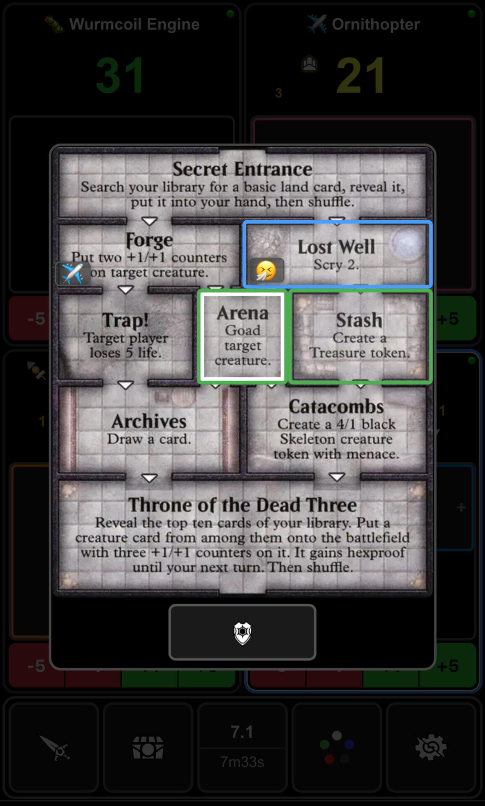
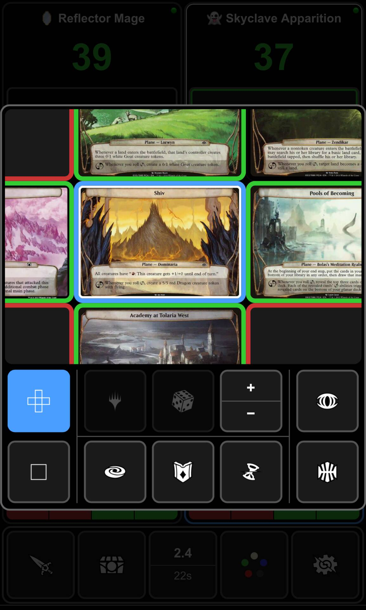

# SALT - Seriously, Another Life Tracker?

SALT is a self-hosted, synced game state management system for `Magic: The Gathering`. Run the server on your own computer and expose it for local or remote play.

## Quick Start

Download the appropriate binary from the [latest release](https://github.com/lxing/salt-release/releases) and run it on a local PC, Mac, or Linux machine. This will spawn a lightweight server that you can access on the local network via mobile browser through displayed QR code. Easy home network setup for kitchen table play.

To play at an LGS, tournament, or on Spelltable, setup Tailscale mobile VPN using [TAILSCALE.md](TAILSCALE.md). The server emits keepalive signals to prevent the machine from sleeping when you leave the home.

> **⚠️ iOS Users:** iOS does not permit screen wake lock from the browser. To prevent your device from sleeping during long games, manually adjust your settings:
> **Settings → Display & Brightness → Auto-Lock → Never**. Wake lock is supported on Android Chrome.

## Features

### Core Gameplay Tracking
- Commander / poison / lifelink damage with group pings
  - Instant damage or buffer damage → commit flow
  - Configurable group pings (everyone, opponents, or drain Zulaport-style)
  - Tax tracking and directional commander damage display
  - Partner commanders
- Player phasing/death tracking with autokill and resurrection
- Turn indicator and turn timers
  - Configurable upkeep/end of turn reminders (once or repeatedly)
- Game reset with selectable/random starting player and life total

### Game Object Support
- Tokens: Treasure, Food, Clue, etc. 
- Experience / Energy / Monarch / Initiative / Tempt / Ascend / Day
  - Per-player stage tracking for Undercity / Ring Tempts
- Planechase deck builder with Eternities Map or classic gameplay

### History Management
- Action log with configurable rollup of consecutive damage events
  - Full game state rollback to any damage event or turn boundary
- Game history and replay functionality
- Global stats: damage dealt/received, tokens created, turn time

### Utilities
- Settable nametags
- D6/8/20 rolls, coin flips, random player selection
- Storm counter and color-toggleable mana pool

## Design Goals

### Minimal Friction
- Local device play - no reaching across tables
- No slow hold or swipe gestures, no animations - instant feedback
- Minimal menu switching (storm players must be able to adjust life/treasures/mana/storm and perform group pings/coinflips in a single screen)
- Intuitive but dense UI with zero text clutter and skeumorphic icons

### Mobile Optimization
- Event-driven architecture to minimize network traffic
- Selective DOM rendering to reduce CPU/memory usage
- Optimized wire encoding, caching, and compression
- Per device, a 1hr game with 500 actions:
  - Loads 250KB assets for initial setup, optional ~7MB for full Planechase deckbuilding (both cached for future sessions)
  - Sends/receives <2MB traffic afterwards per device
- Fixed dark mode

## Screenshots

<table align="center">
<colgroup>
<col width="25%">
<col width="25%">
<col width="25%">
<col width="25%">
</colgroup>
<tr>
<td align="center"> Interface</td>
<td align="center"> Combat</td>
<td align="center"> Storming</td>
<td align="center"> Gameobjects</td>
</tr>
<tr>
<td align="center"> Uh oh</td>
<td align="center"> Logs</td>
<td align="center"> Rollback</td>
<td align="center"> Stats</td>
</tr>
<tr>
<td align="center"> Reminders</td>
<td align="center"> Upkeep</td>
<td align="center"> Settings</td>
<td align="center"> Help</td>
</tr>
<tr>
<td align="center"> Reset</td>
<td align="center"> Dungeons</td>
<td align="center"> Planechase</td>
<td align="center"> Deckbuilder</td>
</tr>
<tr>
<td align="center"> Lobby</td>
<td align="center"> QR sharing</td>
<td align="center"> History</td>
<td align="center"> Replay</td>
<td></td>
</tr>
</table>

## Fan Content Policy

SALT is unofficial Fan Content permitted under the Fan Content Policy. Not approved/endorsed by Wizards. Portions of the materials used are property of Wizards of the Coast. ©Wizards of the Coast LLC. 
